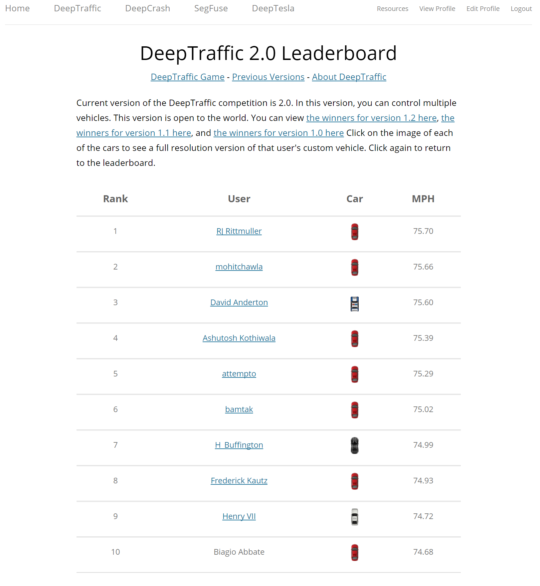

# DeepSolution
The ultimate answer to the MIT DeepTraffic reinforcement learning competition!



### Background
MIT <a href="https://github.com/lexfridman/deeptraffic">"Deep Traffic"</a> was a deep reinforcement learning competition that challenges participants to design neural networks capable of navigating a simulated, congested highway. The competition is part of the MIT Deep Learning series—specifically linked with the MIT course “Deep Learning for Self-Driving Cars” (6.S094)—and offers an engaging, hands-on platform where both beginners and experts can experiment with motion planning and hyperparameter tuning. The initiative was run by Lex Fridman, Jack Terwilliger, and Benedikt Jenik, who aimed to inspire innovative approaches to autonomous vehicle navigation by crowdsourcing solutions and showcasing them on a public leaderboard. 

### Introduciton to Q-Learning
Q-learning is a model-free reinforcement learning algorithm that learns an optimal action-value function, Q(s, a), which estimates the expected cumulative reward of taking a given action a in a state s and following the best policy thereafter. The algorithm iteratively updates its Q-values using the temporal difference error defined by the equation Q(s, a) ← Q(s, a) + α [r + γ maxₐ’ Q(s’, a’) − Q(s, a)], where α is the learning rate, γ is the discount factor, r is the immediate reward, and s’ is the subsequent state. In this <a href="https://cs.stanford.edu/people/karpathy/convnetjs/demo/rldemo.html">Stanford ConvNetJS demo</a>, a neural network approximates this Q-function by taking a set of sensory inputs—simulated as “eyes” that measure distances to walls, rewards (apples), and penalties (poison)—and outputs a value for each of the five possible actions the agent can take. The network is trained using backpropagation as the agent interacts with its environment, and it incorporates techniques such as experience replay and an epsilon-greedy policy to balance exploration with exploitation. This setup effectively demonstrates how deep Q-learning can be used to learn optimal behaviors in complex, high-dimensional spaces without requiring an explicit model of the environment.

### How Q-Learning was used in DeepTraffic
In the DeepTraffic competition, deep Q-learning is harnessed to develop neural networks that drive vehicles through congested highways. Participants designed models that ingest a state representation of the highway—such as an occupancy grid capturing the positions and speeds of surrounding vehicles—and output a set of possible driving actions. The neural network approximates the Q-function, predicting the expected cumulative reward for each action based on the current state, and it is trained using temporal difference learning much like in the classic deep Q-learning setup demonstrated in the above Standford ConvNetJS demo. By continuously updating its parameters through interactions with the simulated traffic environment, the algorithm learns to balance aggressive acceleration with safe maneuvering, optimizing the vehicle’s speed while minimizing collision risks. This approach, adapted from early deep reinforcement learning successes in Atari games, underpins the core mechanics of DeepTraffic and encouraged competitors to explore innovative hyperparameter tuning and network architectures to achieve superior driving performance. 

## How Does DeepSolution Solve DeepTraffic?
DeepSolution implements a complete pipeline for solving the DeepTraffic challenge using deep Q-learning combined with traditional automation and data science tools. It combines both JavaScript (for interfacing with the DeepTraffic simulation) and Python (for data collection, testing, and automation) to streamline the development and evaluation of reinforcement learning strategies.

### File and Directory Breakdown

* <b>data/</b>
  This directory is used to store run data and model weights generated by the solution. For example, when the agent interacts with the DeepTraffic simulation, state-action-reward tuples, current model weights or full episode logs will be saved here. This data is essential for both offline analysis and for potentially re-training or fine-tuning the Q-learning model if the run shows positive metrics.
  <i><ul>The "data/FTW" directory contains the winning model weights.</ul></i>

* <b>runtestcase.py</b>
This script is designed to run a single, predefined test scenario for the DeepTraffic agent. It loads a model (pre-trained or random weights) along with preset hyperparameters, executes a run in the simulation environment, and outputs performance metrics in the form of highest speed driven. Interaction with DeepTraffic is performed by controlling a headless browser using Selenium to perform runs and to record the model's performance while periodically also saving the model weights (checkpointing). This approach enabled a means to quickly assess the effectiveness of the solution under controlled single-run conditions without having to directly monitor the DeepTraffic simulation. The collected data is then stored in the data/ folder for subsequent analysis or further training purposes.

* <b>testall.py</b>
Serving as an automated testing suite, testall.py aggregates multiple test cases. It systematically runs a series of simulation episodes under different conditions to strack the the model's behavior across multiple runs. The script saves results for each test case (run), making it easier to diagnose issues, validate improvements, or benchmark model performance against expected metrics.

* <b>collectdata.py</b>
This Python script is responsible for automating the data extraction and analysis process. It parses the data collected and outputs tabular data that can be used to perform further analysis using standard data science techniques. 

### How It All Works Together

At the core of DeepTraffic solution is a deep Q-learning algorithm that approximates the optimal Q-function for navigating dense traffic, DeepSolution automates the process of hyperparameter discovery and enabled easy testing of various model architectures. During testing the DeepTraffic agent receives a state representation (for example, an occupancy grid from the simulation) and uses the neural network model—trained via temporal difference updates—to decide among a set of possible actions (such as accelerating or changing lanes). The collectdata.py script gathers experiential data from these interactions, which can be used to refine the model hyperparameters and architecture further. Together, these components form a cohesive system for developing, testing, and iterating on a deep reinforcement learning solution aimed at winning the DeepTraffic challenge.

### Winning Network (Architecture / Hyperparameters)
This network produced a top score of <b>76.17</b> which completely destroyed the nearest MIT student's score and effectively closed-the-deal for keeping me on the leaderboard well past the end of the formal competition. 

* <i>NOTE: The screen shot above was taken prior to this score being submitted and I totally forgot to take an updated one after submitting. :-(</i>

```JavaScript
// a few things don't have var in front of them - they update already existing variables the game needs
lanesSide = 6;
patchesAhead = 30;
patchesBehind = 10;
trainIterations = 130000;

// the number of other autonomous vehicles controlled by your network
otherAgents = 10; // max of 10

var num_inputs = (lanesSide * 2 + 1) * (patchesAhead + patchesBehind);
var num_actions = 5;
var temporal_window = 0;
var network_size = num_inputs * temporal_window + num_actions * temporal_window + num_inputs;

var layer_defs = [];
    layer_defs.push({
    type: 'input',
    out_sx: 1,
    out_sy: 1,
    out_depth: network_size
});
layer_defs.push({
    type: 'fc',
    num_neurons: 32,
    activation: 'tanh'
});
layer_defs.push({
    type: 'fc',
    num_neurons: 16,
    activation: 'tanh'
});
layer_defs.push({
    type: 'fc',
    num_neurons: 16,
    activation: 'tanh'
});
layer_defs.push({
    type: 'fc',
    num_neurons: 32,
    activation: 'tanh'
});
layer_defs.push({
    type: 'regression',
    num_neurons: num_actions
});

var tdtrainer_options = {
    learning_rate: 0.01,
    momentum: 0.001,
    batch_size: 192,
    l2_decay: 0.01
};

var opt = {};
opt.temporal_window = temporal_window;
opt.experience_size = 30000;
opt.start_learn_threshold = 500;
opt.gamma = 0.98;
opt.learning_steps_total = 150000;
opt.learning_steps_burnin = 500;
opt.epsilon_min = 0.01;
opt.epsilon_test_time = 0.001;
opt.layer_defs = layer_defs;
opt.tdtrainer_options = tdtrainer_options;
```
### Citation

```
@misc{rittmuller2019deepsolution,
  author = {Rittmuller, Robert},
  title = {DeepSolution: The Ultimate Answer to the MIT DeepTraffic Reinforcement Learning Competition},
  year = {2019},
  publisher = {GitHub},
  howpublished = {\url{https://github.com/robertrittmuller/deepsolution}},
  note = {Accessed: February 17, 2019}
}
```
